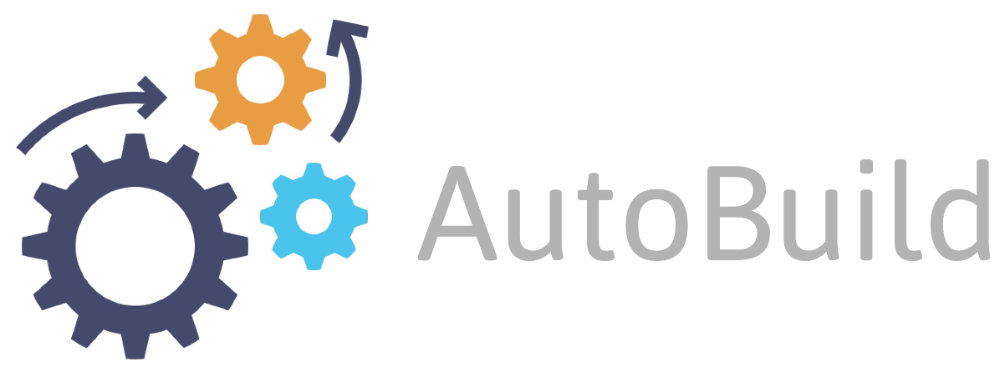
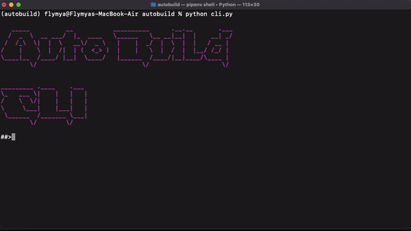
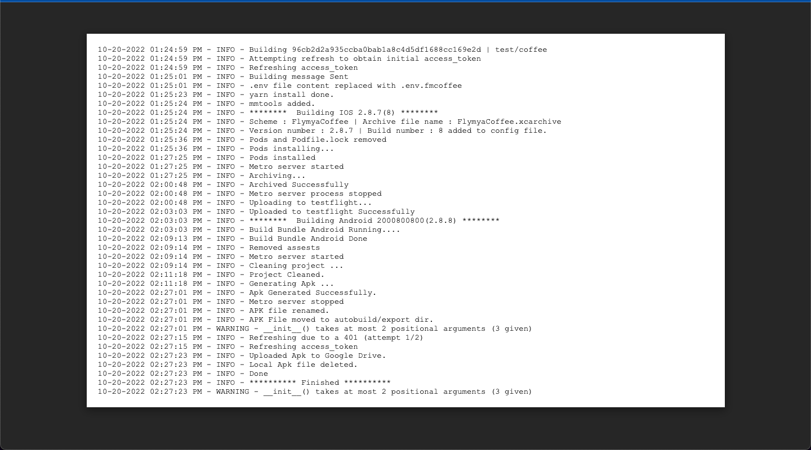
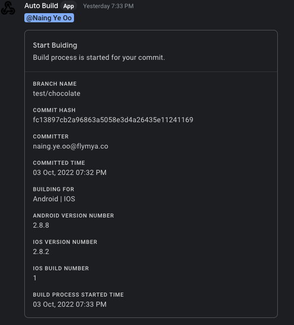
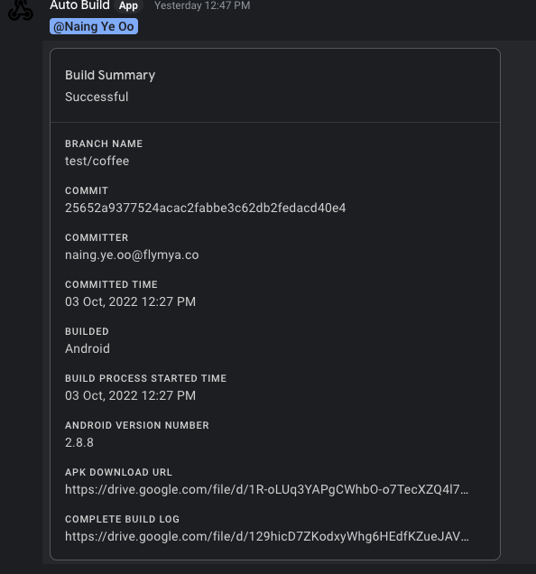
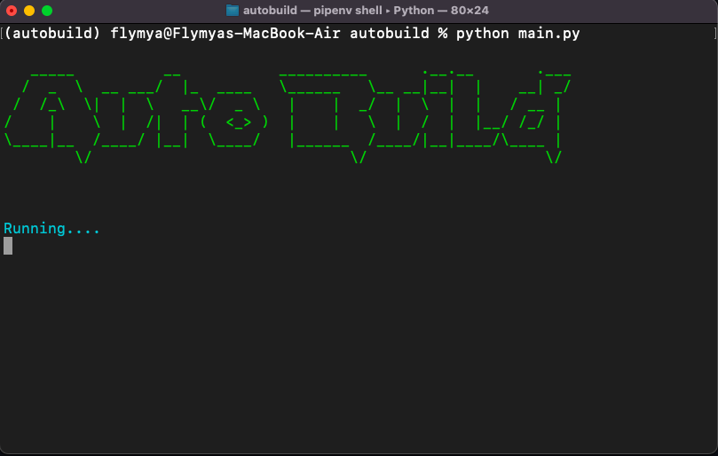

<div align="center">
    
</div>

<br/><br/><br/>

Autobuild is a CI/CD automation for Flymya Mobile App (Android/IOS).

## About

When we want to generate archive or apk, we have to open the xcode for ios and android studio for apk, and build it manually everytime. The company give the frontend developers a seperate machine to do the building.

Autobuild is programmed to build archive and apk automatically whenever there is a new code pushed to the tracked branch just like jenkins.

When a new code is pushed to the tracked branch, the autobuild program will pull the latest commit and install node packages, replace and .env file contents accroding to the app varient. It will send a google chat message containing all the build information to inform the developer that the build procecess is started for his/her commit. After the build is done, it will send another google chat message about the build summary.

When a build process is done, it will upload the ios archive file to the testflight and android apk to the google drive and send the drive apk share url in build summary message so that the apk can be shared to the POs for testing.

It will also create a Log file for the build. If a build process fail, the developers will know exactly what went wrong by looking at the logs.

Unlike jenkins it can only build one process at a time. If a new code is pushed to the other tracked branch and one build process already running, the program will store the incomming new commit info to the queue, so it can be built after the first one is done.

A CLI is also added to interact with the program.<br/>


## Install

To install the program follow these steps. You need to add configrations in the **settings.py** file, according to your project structure, git branch, google chat and google drive.

**NOTE** : This project is created to automate only Flymya mobile app build process. It may not work with other projects, but if you still want to do setup for your own project then follow the below instructions.

After cloning the repository, create a virtual environment for python.

```
$ pipenv shell
```

Install all the packages

```
$ pipenv install
```

Download your google-service-key.json from google api console, and start the builder

```
$ python main.py
```

To open the CLI program

```
$ python cli.py
```

## Screenshots





